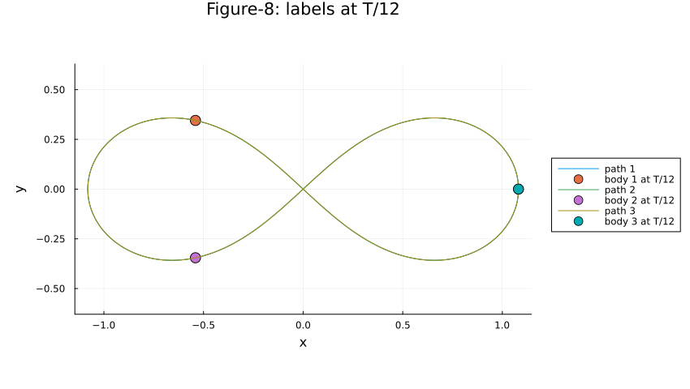

# 三体运动数值验证与八字轨道复现

独立的数值计算课程研究项目。采用 Julia 自编 RK4，依次检查固定中心力、二体、三体初值问题，再复现 Moore 发现的等质量 figure-eight 轨道。Python/SciPy DOP853 提供独立实现的参考解。



## 阅读报告

- [规范中文报告（Word）](docs/三体问题数值计算汇报.docx)：中英文摘要、原理、伪代码、图表、误差讨论和15项参考文献。作者栏留空。
- [报告纯文本](docs/report.md)
- [完整教学 Notebook](三体问题数值求解.ipynb)：发布版清除了执行输出。图像预览见 `figures/`；重新执行可生成完整输出。

## 快速复现

要求 Julia 1.10 或以上（已验证1.12.7），Python3.11或以上。所有命令均在本仓库根目录执行。

```sh
julia --startup-file=no --project=. -e 'using Pkg; Pkg.instantiate()'
python3 scripts/build_threebody.py --export-only
julia --startup-file=no --project=. tmp/threebody/threebody.jl
```

完整脚本生成基本任务和八字轨道图、数据摘要，并包含长期积分扩展示例。输出图位于 `tmp/threebody/`，摘要位于 `data/`。首轮运行会预编译依赖。

执行 Notebook（可选）：

```sh
python3 -m venv .venv
. .venv/bin/activate
python -m pip install -r requirements.txt
python scripts/execute_threebody.py
```

独立参考数据已随仓库提供；重新生成需要上述 Python 依赖：

```sh
python scripts/threebody_reference.py
```

生成环境版本与容差、初值、采样数及CSV校验值保存在 `data/threebody_reference/metadata.json`。参考数据是高精度数值对照，不是数学意义上的精确解或严格误差界。

## 验证

```sh
python3 tests/run_tests.py
python3 tests/test_threebody_delivery.py
```

本次通过23项 Julia 数值断言和3项 Python交付检查。Julia需在 PATH 中；这些检查不要求额外 Python包。

## 主要结果与限制

| 算例 | RK4与独立参考的最大状态差 |
|---|---:|
| 固定中心力，t=0–50，h=0.001 | 1.51e-13 |
| 二体，t=0–20，h=0.001 | 1.57e-13 |
| 三体，t=0–30，h=0.001 | 1.47e-12 |
| 八字，一周期9600步 | 1.62e-12 |

- G=1；固定中心力额外取中心质量M=1，因此给定初值产生抛物线。
- 二体须去除质心匀速漂移；三体有限时段内的分离不能单独证明永久逃逸或混沌。
- 八字算例采用三个单位质量，与基本任务的质量比例不同。近似周期6.32591398。
- 八字一周期状态闭合残差约3.90e-8；其平台与初值、周期有效位数相符。20周期检验不等于无限时间稳定性证明。
- 本项目复现已知轨道，不复现Moore原文的作用量极小化搜索算法。

## 文件组织

- `src/threebody/`：可维护的Notebook文本源与共用验证函数。
- `scripts/`：构建、执行与独立参考生成。
- `data/`：参考轨迹、校验信息和结果摘要。
- `tests/`：独立项目检查。
- `figures/`：已验证图像。
- `docs/`：匿名报告与来源说明。

`src/threebody/notebook_source.json` 是Notebook的主要源文件；构建脚本把共用验证函数同步入Notebook，避免版本不一致。

## 文献与已有开源工作

1. Moore (1993), *Braids in Classical Dynamics*, PRL70,3675–3679. [原文](https://sites.santafe.edu/~moore/pubs/braids-prl.pdf)，[DOI](https://doi.org/10.1103/PhysRevLett.70.3675)。
2. Chenciner & Montgomery (2000), *A remarkable periodic solution of the three-body problem in the case of equal masses*, Annals of Mathematics152,881–901. [论文](https://arxiv.org/abs/math/0011268)。
3. 初值来源：[GeometricProblems.jl 三体示例](https://juliagni.github.io/GeometricProblems.jl/latest/three_body_problem/)。本文重排了物体编号。
4. 实际独立积分器：[SciPy DOP853](https://docs.scipy.org/doc/scipy/reference/generated/scipy.integrate.DOP853.html)。
5. 可供扩展：[REBOUND](https://github.com/hannorein/rebound)、[DifferentialEquations.jl](https://github.com/SciML/DifferentialEquations.jl)、[GeometricProblems.jl](https://github.com/JuliaGNI/GeometricProblems.jl)。前两者未用于本次轨迹对照。

## 隐私与引用

仓库使用新的独立提交历史，不包含其他课程笔记、账号配置、个人邮箱、本机绝对路径或原Notebook的执行日志。报告中的作者、单位、专业和学号留空。GitHub账号及仓库归属仍可由仓库地址识别；私有仓库仅授权读者可访问。未附带老师的格式要求原文件。

尚未指定开源许可证；仓库可见性不代表授予开源许可。第三方依赖与参考文献保留各自权利。
