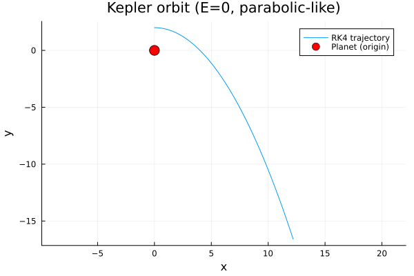
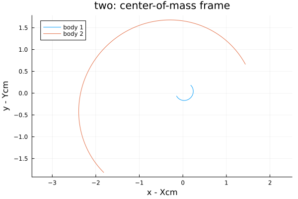
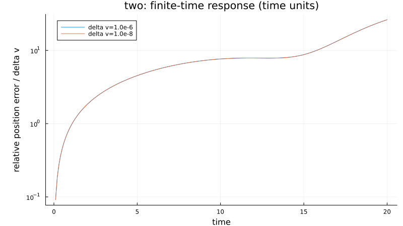
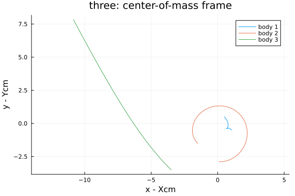
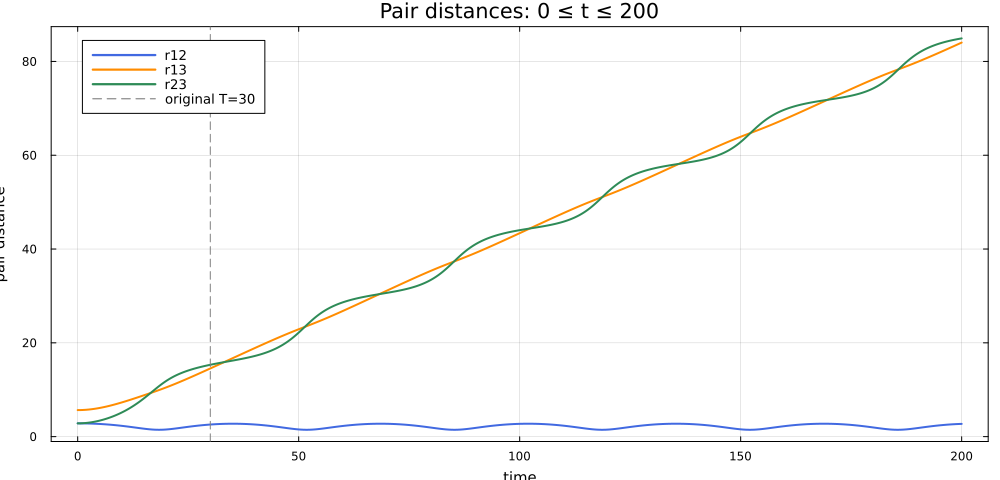
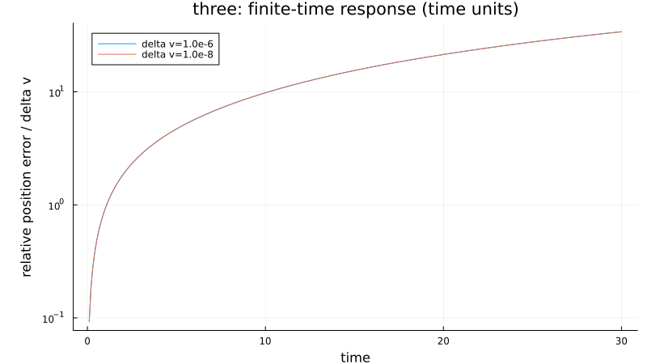

# 三体运动数值验证与八字轨道复现

三体运动数值验证与八字轨道复现

作者：张志杨

（天津大学机械工程学院；工程力学强基班；学号 3024201037）

摘要：本文按固定中心力、二体和三体的顺序计算引力轨道，并复现等质量三体的八字轨道。程序采用四阶龙格—库塔法，通过解析解、守恒量、步长减半、时间反演和独立的 DOP853 参考轨迹检验结果。给定单体算例得到抛物线；二体在质心系中的相对轨道为椭圆；三体在计算时段内明显分离。基本算例与独立参考的最大状态差处于 10⁻¹³ 至 10⁻¹² 量级。八字轨道的一周期闭合残差约为 3.90×10⁻⁸，计算 20 周期后仍保持八字形态。步长扫描显示，闭合残差的平台主要来自初值和周期的小数精度。这些结果说明给定时段内的数值计算可靠，但有限时间内的分离与闭合轨迹均不足以证明永久逃逸、混沌或长期稳定性。

关键词：三体问题；龙格—库塔法；数值验证；八字轨道；初值敏感性

Numerical Validation of Three Body Motion and
Reproduction of the Figure Eight Orbit

Author: ZHANG Zhiyang

(School of Mechanical Engineering, Tianjin University; Engineering Mechanics; Student ID 3024201037)

Abstract: This paper computes gravitational trajectories in the order of the fixed-center, two-body, and three-body problems, followed by the equal-mass figure-eight orbit. The calculations use a Julia implementation of the classical fourth-order Runge–Kutta method. We check the results against an analytical orbit where available, an independent DOP853 solution, conservation laws, step refinement, and time reversal. With the prescribed initial conditions, the fixed-center orbit is parabolic. In the two-body case, the relative orbit is elliptical and the center of mass moves uniformly. The three-body trajectories separate over the simulated interval, although this does not establish permanent escape or chaos. For the basic examples, the largest state differences from the independent reference are of order 10⁻¹³ to 10⁻¹². Two small velocity perturbations are also tested in each interacting system after removing its own center-of-mass motion; their effects remain distinguishable from numerical error. For the additional figure-eight case, we examine one-period closure, the cyclic exchange of bodies after one third of a period, minimum pairwise distance, and conservation errors over twenty periods. The orbit retains its figure-eight shape, while the one-period closure residual levels off near 3.90×10⁻⁸. A step-size scan indicates that the plateau is mainly due to the decimal precision of the initial state and period. These checks support the reported trajectories over the stated intervals. They do not, by themselves, prove long-term stability or the existence of an exact periodic orbit.

Keywords: three-body problem; Runge–Kutta method; numerical validation; figure-eight orbit; initial-condition sensitivity

引言

固定中心力问题有可供核对的开普勒解；孤立二体可分解为质心运动和相对运动。三体相互作用则把三个天体的轨道耦合在一起，通常需要针对给定初值进行数值积分。判断积分是否可信，不能只看轨迹图：计算步长、守恒量、质心运动和初值扰动都提供了不同的检验线索。

八字轨道是三体问题中一个特别的周期解：三个等质量天体沿同一条八字曲线依次运动。Moore 于 1993 年通过数值探索发现这一轨道[1]；Chenciner 与 Montgomery 后来证明了它的存在性[2]。关于其稳定性和分岔，后续还有专门研究[3]。因此，轨迹在图上闭合，并不等于已经证明它长期稳定。

已有工作还提供了结构保持积分方法[4]、开源多体程序 REBOUND[5]、高阶积分器 IAS15[6]及 Julia 微分方程生态[7]。这些工作说明三体计算已有多种成熟工具，但本报告仍从课堂初值和自编 RK4 程序出发，按单体、二体、三体的顺序验证，最后复现八字轨道。REBOUND、IAS15 和 DifferentialEquations.jl 只用于介绍相关工作；实际的独立对照采用 SciPy DOP853。

1  模型与数值方法

1.1  无量纲模型

所有算例采用无量纲量，取引力常数 G=1，不引入引力软化。单体问题指中心天体固定、卫星反作用可忽略的模型，并补充取中心质量 M=1。对相互作用的 N 个质点，令状态 z 依次排列所有位置与所有速度，运动方程为

ṙᵢ = vᵢ，　v̇ᵢ = G ∑ⱼ≠ᵢ mⱼ (rⱼ − rᵢ) / ‖rⱼ − rᵢ‖³ (1-1)

两体距离趋于零时原方程奇异。本次给定时间区间内均未发生碰撞，结论不延伸到未计算时段。各算例初值、时间区间及检验结果在相应小节给出。

1.2  积分算法与伪代码

主程序采用 Julia[8] 编写，以经典 RK4 为基本积分器，基本任务步长 h=0.001。独立 Python 实现采用 NumPy 数组[9]与 SciPy[10]，通过 DOP853 的高阶自适应积分生成参考数据[11]；该算法的原始代码可由 Hairer 的软件页面追溯[12]。项目同时保留 Dormand–Prince 自适应方法作为扩展对照[13]，误差控制设计参照嵌入式 Runge–Kutta 方法的相关讨论[14]。

伪代码1  RK4 轨道积分

输入：质量数组 m；初始状态 z₀；终止时间 T；最大步长 h
输出：已保存的时间与状态序列

01  t ← 0
02  z ← z₀
03  保存 (t, z)
04  while t < T do
05      Δt ← min(h, T − t)
06      k₁ ← f(t, z; m)
07      k₂ ← f(t + Δt/2, z + Δt k₁/2; m)
08      k₃ ← f(t + Δt/2, z + Δt k₂/2; m)
09      k₄ ← f(t + Δt, z + Δt k₃; m)
10      z ← z + Δt(k₁ + 2k₂ + 2k₃ + k₄)/6
11      t ← t + Δt
12      if z 含非有限值 then
13          return 积分失败
14      end if
15      保存 (t, z)
16  end while
17  return 已保存的时间与状态序列

程序逐对计算天体间的引力，再按式（1-1）组装各天体的加速度。对光滑且远离碰撞的轨道，RK4 的全局误差随步长呈四阶下降；步长很小时，舍入误差会逐渐显现，误差不一定继续按预期比例下降。

1.3  正确性检验指标

对二体、三体计算能量 E、总动量 P、角动量 Lz 和质心 R。令 M 为总质量，rij 为物体间距离，内部能量 Ec 去除整体平动动能：

E = ½∑ᵢ mᵢ‖vᵢ‖² − ∑ᵢ<ⱼ Gmᵢmⱼ/rᵢⱼ，　Eᵢₙₜ = E − ‖P‖²/(2M) (1-2)

P = ∑ᵢ mᵢvᵢ，　Lz = ∑ᵢ mᵢ(xᵢvᵧᵢ − yᵢvₓᵢ) (1-3)

R(t) = R(0) + P(0)t/M (1-4)

本文将同一采样时刻所有无量纲状态分量的最大绝对差记为参考差。基本算例每隔 0.1 采样一次，守恒量则在主积分的每一步检查。DOP853 的容差设为 rtol=3×10⁻¹⁴、atol=3×10⁻¹⁶，并用较宽容差再算一次。参考轨迹也受离散和舍入误差影响，两种算法吻合不能视为严格的误差上界。

伪代码2  多重数值验证

输入：算例集合 C；步长 h；公共采样网格 Γ；扰动集合 {10⁻⁶, 10⁻⁸}
输出：验证记录 Q（参考差、收敛差、守恒量、反演和轨道诊断）

01  Q ← ∅
02  for c ∈ C do
03      Z_h ← RK4(c, h)
04      Z_h/2 ← RK4(c, h/2)
05      Q[c].step ← max_{t∈Γ} ‖Z_h(t) − Z_h/2(t)‖∞
06      if c 有解析解 A_c(t) then
07          Q[c].reference ← max_{t∈Γ} ‖Z_h(t) − A_c(t)‖∞
08      else
09          Z_ref ← DOP853(c, Γ)
10          Q[c].reference ← max_{t∈Γ} ‖Z_h(t) − Z_ref(t)‖∞
11      end if
12      if c 为相互作用的多体系统 then
13          Q[c].conservation ← 漂移(E, P, Lz, R(t) − R(0) − P(0)t/M)
14      end if
15      c_rev ← 将 c 的初态替换为 (r_h(T), −v_h(T))
16      Z_rev ← RK4(c_rev, h)
17      Q[c].reverse ← ‖(r_rev(T), −v_rev(T)) − z₀‖∞
18      if c 配置了初值扰动 then
19          for δ ∈ {10⁻⁶, 10⁻⁸} do
20              Z_δ,h ← RK4(扰动(c, δ), h)
21              Z_δ,h/2 ← RK4(扰动(c, δ), h/2)
22              D_δ,h(t) ← 去质心位置差(Z_δ,h(t), Z_h(t))
23              D_δ,h/2(t) ← 去质心位置差(Z_δ,h/2(t), Z_h/2(t))
24              Q[c,δ].response ← D_δ,h(T)
25              Q[c,δ].step ← max_{t∈Γ} |D_δ,h(t) − D_δ,h/2(t)|
26          end for
27      end if
28      if c 为八字算例 then
29          Q[c].closure ← ‖Z_h(T) − Z_h(0)‖∞
30          Q[c].symmetry ← max_t ‖Z_h(t + T/3) − ΠZ_h(t)‖∞
31          Q[c].distance ← min_{t, i<j} ‖rᵢ(t) − rⱼ(t)‖₂
32      end if
33  end for
34  return Q

其中，去质心位置差是两条轨迹在各自质心系中所有物体位置差的欧氏范数；Π 表示三体编号的循环置换。

2  单体、二体与三体结果

2.1  单体轨道与解析验证

固定中心力的标量方程为 d²x/dt²=−x/(x²+y²)^(3/2)，d²y/dt²=−y/(x²+y²)^(3/2)，其中 G=M=1。

固定中心质量 M=1，卫星初始位置 (x₀,y₀)=(0,2)、初始速度 (vₓ₀,vᵧ₀)=(1,0)，积分至 T=50。由初值得单位质量机械能 v²/2−1/r=0，角动量为 −2，故轨道是抛物线。设辅助变量 D 满足 D+D³/3=t/4，则解析位置与速度为

D = 2sinh[arsinh(3t/8)/3]，x = 4D，y = 2 − 2D² (2-1)

vₓ = 1/(1+D²)，vᵧ = −D/(1+D²) (2-2)

消去 D 得 x²=16−8y。数值轨迹如图 2-1 所示，与解析轨迹吻合。该结论依赖补充假设 GM=1；若中心质量不同，同一初始速度可能对应不同类型的圆锥曲线。

图2-1  固定中心力算例的抛物线轨道

RK4 与解析解的完整状态最大相差 4.14×10⁻¹³，与独立 DOP853 轨迹最大相差 1.51×10⁻¹³。将步长从 0.001 减半，两次结果的最大差为 2.31×10⁻¹³；时间反演误差为 1.33×10⁻¹⁵。这些数值与图 2-1 中两条轨迹的重合相符。

2.2  二体轨道、验证与微扰

取 m₁=0.30、m₂=0.03，初始位置分别为 (2,2)、(0,0)，初始速度分别为 (0.2,−0.2)、(−0.01,0.01)，积分至 T=20。初始总动量 P₀=(0.0597,−0.0597)，故惯性系轨迹含质心平动；图 2-2 在各自质心系中显示相对轨道。

去除质心平动后，内部能量为 −0.00197925，半长轴约 2.273585、偏心率约 0.244039、周期约 37.4964，故相对运动为椭圆。总能量虽为正值 0.00882102，但包含整体平动能；T=20 尚未覆盖一整周，不能以图线未闭合判断积分失败。

图2-2  二体运动的质心系轨迹

与独立 DOP853 轨迹相比，最大状态差为 1.57×10⁻¹³；步长减半差为 1.98×10⁻¹³，时间反演误差为 6.76×10⁻¹⁵。全部积分步上，能量、动量、角动量和质心直线运动的最大偏差依次约为 9.54×10⁻¹⁷、4.30×10⁻¹⁶、1.39×10⁻¹⁵ 和 3.20×10⁻¹⁴。

分别将第二体初始 y 方向速度增加 10⁻⁶ 和 10⁻⁸。扣除各自的质心平动后，T=20 时全体位置差的欧氏范数分别为 2.619520×10⁻⁵ 和 2.619521×10⁻⁷。图 2-3 将位置差除以对应的扰动幅值；两条曲线基本重合。扰动信号的步长减半差约为 10⁻¹³，明显小于观测到的响应。

图2-3  二体去质心轨迹差随时间的变化（纵轴为位置差／速度扰动幅值）

2.3  三体轨道、验证与微扰

取 m₁=0.30、m₂=m₃=0.03，初始位置依次为 (2,2)、(0,0)、(−2,−2)，初始速度依次为 (0.2,−0.2)、(0,0)、(−0.2,0.2)，积分至 T=30。初始质心为 (1.5,1.5)，质心速度为 (0.15,−0.15)；图 2-4 给出质心系运动轨迹。

图2-4  三体运动的质心系轨迹

在 T=30 时，三组两体距离约为 2.5783、14.5385、15.3203，距离变化见图 2-5；全步最小两体距离约为 1.4621。总能量约 0.00810883，内部能量约 8.83118×10⁻⁶。第三体在观测时段内远离前两体，但有限时间轨迹尚不能证明永久逃逸，也不能直接证明混沌。

图2-5  三体算例中三组两体距离随时间的变化

三体轨迹与独立 DOP853 结果的最大状态差为 1.47×10⁻¹²；步长减半差为 1.34×10⁻¹³，时间反演误差为 5.31×10⁻¹⁵。全部积分步上，能量、动量、角动量和质心运动的最大偏差依次约为 3.59×10⁻¹⁶、8.19×10⁻¹⁶、3.44×10⁻¹⁵ 和 3.91×10⁻¹⁴。守恒量的变化很小，独立轨迹与步长检验也给出一致结果。

分别将第三体初始 x 方向速度增加 10⁻⁶ 和 10⁻⁸，并在各自质心系中比较轨迹。T=30 时，全体位置差分别为 3.398810×10⁻⁵ 和 3.398811×10⁻⁷。图 2-6 显示，按扰动幅值归一化后，两档响应几乎重合；对应的步长减半差约为 10⁻¹³。这里观察的是有限时间内的初值响应，尚未计算 Lyapunov 指数。

图2-6  三体去质心轨迹差随时间的变化（纵轴为位置差／速度扰动幅值）

本算例的检验依据是能量、动量和角动量守恒，质心匀速直线运动，步长减半、时间反演，以及独立 DOP853 轨迹对照；数值积分与多体方法可参见文献[4-6,11]。这些检验支持给定时段内的计算结果，无法单独说明三体系统的长期运动。

3  八字周期轨道复现

3.1  文献对应与初始条件

本节复现三个等质量天体沿同一八字曲线依次运动的周期解[1-2]。这里计算轨道本身，不重做 Moore 寻找轨道时使用的作用量极小化过程。初值取自 GeometricProblems.jl 的公开三体示例[15]，并按本文的物体编号重排。表中的小数来自该示例，不能直接写成 Moore 论文给出的初值。

取 G=1、m₁=m₂=m₃=1、近似周期 T=6.32591398。它是与基本任务质量比例不同的独立算例。表 3-1 的初态满足质心在原点、总动量和总角动量为零。

表3-1  八字轨道的无量纲初始条件

表3-1  八字轨道的无量纲初始条件
物体 | 初始位置 (x, y) | 初始速度 (vx, vy)
1 | (−0.97000436, 0.24308753) | (0.466203685, 0.432365730)
2 | (0, 0) | (−0.932407370, −0.864731460)
3 | (0.97000436, −0.24308753) | (0.466203685, 0.432365730)

图3-1  八字轨道及 t=T/12 时的三体位置

[图] 图3-1  八字轨道及 t=T/12 时的三体位置

3.2  周期闭合与舞蹈对称性

将每周期步数从 300 逐次增加到 9600。周期闭合残差取末态与初态的最大分量差；参考差取同一初值下 RK4 和 DOP853 在公共网格上的最大分量差。前者检查闭合程度，后者检查两种算法的一致性。

表3-2  一周期闭合与独立参考差

表3-2  一周期闭合与独立参考差
每周期步数 | 完整状态闭合残差 | 与 DOP853 最大差
300 | 1.58×10⁻⁶ | 2.61×10⁻⁶
600 | 4.31×10⁻⁸ | 1.44×10⁻⁷
1200 | 3.55×10⁻⁸ | 8.37×10⁻⁹
2400 | 3.88×10⁻⁸ | 5.04×10⁻¹⁰
4800 | 3.90×10⁻⁸ | 3.05×10⁻¹¹
9600 | 3.90×10⁻⁸ | 1.62×10⁻¹²

步长减小时，RK4 与 DOP853 的参考差持续下降，周期闭合残差却停在约 3.90×10⁻⁸。DOP853 自身的一周期闭合残差也约为 3.90×10⁻⁸，说明这一平台与初值及周期的小数截断相符，不能据此判断 RK4 不收敛。每周期 600 步时的闭合残差虽偶然较小，参考差并未同步达到最小。

在本文物体顺序下，时间推进 T/3 后，完整状态应对应原状态的物体置换 (1, 2, 3)→(3, 1, 2)。采用每周期 2400 步，第一周期内的位置与速度联合置换残差约为 2.83×10⁻⁸，支持三体沿同一路径依次追逐的舞蹈对称性。

3.3  二十周期验证与局限

以 h=T/2400 积分 20 周期后，位置和速度的闭合残差分别约为 5.75×10⁻⁷ 和 7.49×10⁻⁷；与独立参考轨迹的最大状态差约为 2.24×10⁻⁸。全程能量绝对漂移不超过约 8.62×10⁻¹¹，最小两体距离约为 0.69053。将参考轨迹的容差进一步收紧，两次参考结果相差约 5.22×10⁻⁹，因此长时间对照也需考虑参考解自身的误差。

图3-2  八字轨道的步长扫描与二十周期检验

[图] 图3-2  八字轨道的步长扫描与二十周期检验

图 3-2 给出积分误差、周期闭合残差和局部相位投影。相位投影把位置误差分解到参考速度方向，只用来区分沿轨道与横向的偏离，不是对全局相位的精确重建。积分 20 周期后仍呈八字形，也不能据此断言轨道在无限时间内稳定；相关的存在性证明和稳定性分析见文献[2-3]。

4  可复现性与项目组织

源代码、独立参考数据、图像和检查脚本汇集于独立 GitHub 仓库：

https://github.com/zhangzhiyang2006/three-body-numerical-study

仓库保存了 Notebook、源文件、Julia 环境声明、Python 依赖文件和参考数据的 SHA-256 校验值，不包含程序运行输出。主程序负责计算与绘图；参考脚本独立实现成对引力，并生成 DOP853 对照数据。结果以 TOML 文件保存，安装和运行方法见 README。项目已通过 23 项 Julia 数值检查和 3 项 Python 交付检查。

源文件保留相对路径；姓名、学号、个人邮箱、本机绝对路径、临时日志与其他课程作业不纳入发布内容。作者信息在本地提交稿中自行填写，GitHub 仓库只保留匿名版本。仓库访问受其可见性设置控制。

5  总结与展望

按老师给定的顺序，本文先计算单体、二体和三体，再复现八字轨道。单体数值轨迹与抛物线解析解吻合；二体在质心系中的相对运动为椭圆；三体在给定时段内与独立积分结果一致。二体和三体的两档微小速度扰动均产生了高于数值误差的轨迹差。等质量八字算例还满足近似周期闭合与 T/3 状态置换，积分 20 周期后仍可辨认其轨道形态。

现有计算受初值精度和积分时长限制。若要进一步减小八字轨道的闭合残差，可用高精度射击法同时修正初值与周期；若要判断局部稳定性，则需积分变分方程并计算特征乘子。近碰撞轨道还需要事件检测或正则化处理。上述工作属于后续研究，本文不将其作为已完成结果。

参考文献

[1] MOORE C. Braids in classical dynamics[J]. Physical Review Letters, 1993, 70(24): 3675-3679. DOI: 10.1103/PhysRevLett.70.3675.

[2] CHENCINER A, MONTGOMERY R. A remarkable periodic solution of the three-body problem in the case of equal masses[J]. Annals of Mathematics, 2000, 152(3): 881-901. DOI: 10.2307/2661357.

[3] GALÁN J, MUÑOZ-ALMARAZ F J, FREIRE E, et al. Stability and bifurcations of the figure-8 solution of the three-body problem[J]. Physical Review Letters, 2002, 88(24): 241101. DOI: 10.1103/PhysRevLett.88.241101.

[4] HAIRER E, LUBICH C, WANNER G. Geometric numerical integration illustrated by the Störmer–Verlet method[J]. Acta Numerica, 2003, 12: 399-450. DOI: 10.1017/S0962492902000144.

[5] REIN H, LIU S F. REBOUND: An open-source multi-purpose N-body code for collisional dynamics[J]. Astronomy & Astrophysics, 2012, 537: A128. DOI: 10.1051/0004-6361/201118085.

[6] REIN H, SPIEGEL D S. IAS15: A fast, adaptive, high-order integrator for gravitational dynamics, accurate to machine precision over a billion orbits[J]. Monthly Notices of the Royal Astronomical Society, 2015, 446(2): 1424-1437. DOI: 10.1093/mnras/stu2164.

[7] RACKAUCKAS C, NIE Q. DifferentialEquations.jl—A performant and feature-rich ecosystem for solving differential equations in Julia[J]. Journal of Open Research Software, 2017, 5(1): 15. DOI: 10.5334/jors.151.

[8] BEZANSON J, EDELMAN A, KARPINSKI S, et al. Julia: A fresh approach to numerical computing[J]. SIAM Review, 2017, 59(1): 65-98. DOI: 10.1137/141000671.

[9] HARRIS C R, MILLMAN K J, VAN DER WALT S J, et al. Array programming with NumPy[J]. Nature, 2020, 585: 357-362. DOI: 10.1038/s41586-020-2649-2.

[10] VIRTANEN P, GOMMERS R, OLIPHANT T E, et al. SciPy 1.0: Fundamental algorithms for scientific computing in Python[J]. Nature Methods, 2020, 17: 261-272. DOI: 10.1038/s41592-019-0686-2.

[11] SCIPY DEVELOPERS. scipy.integrate.DOP853[EB/OL]. [2026-10-01]. https://docs.scipy.org/doc/scipy/reference/generated/scipy.integrate.DOP853.html.

[12] HAIRER E. Fortran codes for differential equations[EB/OL]. [2026-10-01]. https://www.unige.ch/~hairer/software.html.

[13] DORMAND J R, PRINCE P J. A family of embedded Runge-Kutta formulae[J]. Journal of Computational and Applied Mathematics, 1980, 6(1): 19-26. DOI: 10.1016/0771-050X(80)90013-3.

[14] SHAMPINE L W. Some practical Runge-Kutta formulas[J]. Mathematics of Computation, 1986, 46(173): 135-150. DOI: 10.1090/S0025-5718-1986-0815836-3.

[15] JULIAGNI CONTRIBUTORS. Three body problem: GeometricProblems.jl[EB/OL]. [2026-10-01]. https://juliagni.github.io/GeometricProblems.jl/latest/three_body_problem/.
